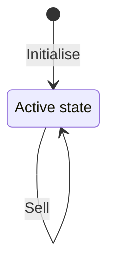

# Part 1: Planning and setup

We start with setting up the project dependencies and a CI build. We're going to use [aiken](https://aiken-lang.org/) for the on-chain code and [sc-tools](https://github.com/j-mueller/sc-tools) for the off-chain code.

hodlcoin is a half-serious app that rewards users for holding their tokens as long as possible. The state of the app consists of a single UTxO that holds the reserves and a counter recording the amount of hodlcoins in circulation.

There are two actions that can be performed on the contract: Buy tokens and sell tokens.

## Scripts

We will need two scripts, a minting policy governing the minting and burning of hodlcoins, and a validator that locks the output with the contract state.

Both scripts will be stored as reference scripts.

## Order processing

The architecture allows the processing of exactly one order per transaction. For the sake of simplicity we will not implement an order book or similar pattern to increase throughput. However, if there is so much demand for hodlcoin that UTxO contention becomes an issue, we can add an order script afterwards, without having to change the two core scripts.

## Aiken - Haskell integration

The untyped plutus core (UPLC) of the validator and minting scripts written in aiken will be serialised to a binary file. We will take the serialised scripts and make them available to the haskell off-chain code in a haskell package called `hodlcoin-onchain`. 
